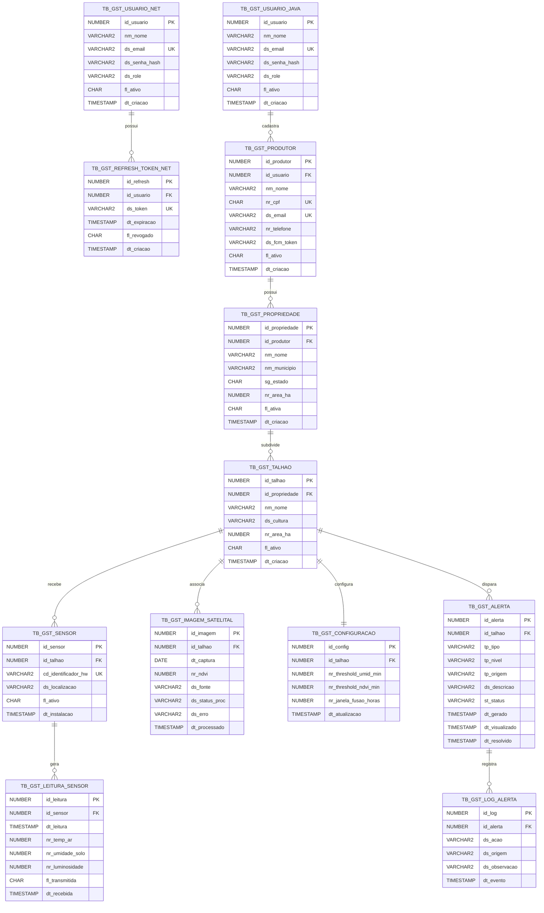

# GeoSat Admin API — .NET Backend

API REST administrativa do sistema **GeoSat**, plataforma de monitoramento
agrícola via satélite + IoT para produtores rurais brasileiros.

> **FIAP — Global Solution 2026/1 | 2TDS Fevereiro**

---

## Links

| Recurso | Link |
|---------|------|
| Swagger UI (local) | *http://localhost:5146/swagger* |
| Vídeo Demonstração (8 min) | *https://youtu.be/sCvdmr28kG0?si=Glumr6_0f3weXs2H* |
| Vídeo Pitch (3 min) | **[SUBSTITUIR após gravação]** |
| Repositório GitHub | *https://github.com/olavoneves/geosat-.net* |

---

## 📐 Diagrama de Entidades

> Banco Oracle compartilhado por Java API e .NET API — schema único com 14 tabelas.



---

## Arquitetura

```
GeoSat.API/
├── Controllers/     # Endpoints REST com Swagger annotations
├── Data/
│   ├── AppDbContext.cs       # 11 DbSets + relacionamentos 1:N e 1:1
│   └── Migrations/           # InitialCreate vazia (banco já existe)
├── DTOs/
│   ├── Request/   # C# Records com Data Annotations
│   └── Response/  # C# Records imutáveis
├── Middleware/    # AuthMiddleware — auth manual via SHA-256
├── Models/        # Entidades mapeadas para TB_GST_*
├── Services/      # Lógica de negócio e queries com Include()
└── Exceptions/    # GlobalExceptionHandler → IExceptionHandler
```

### Por que essa arquitetura?

Separação clara de responsabilidades: controllers recebem e validam,
services executam a lógica, repositório (DbContext) acessa os dados.
Facilita manutenção e adição de novas funcionalidades sem afetar outras camadas.

### Migration — decisão técnica

O banco Oracle já existe e é compartilhado com a Java API.
A migration `InitialCreate` foi criada com `Up()` vazia para registrar
o estado atual sem executar DDL. O EF Core gerencia apenas a tabela
`__EFMigrationsHistory` — nenhuma tabela de negócio é criada ou alterada.

### Relacionamentos implementados

- **1:N** — `Produtor → Propriedades` (um produtor tem várias propriedades)
- **1:N** — `Talhao → Alertas` (um talhão gera vários alertas)
- **1:N** — `Alerta → LogsAlerta` (um alerta tem vários registros de auditoria)
- **1:1** — `Talhao → Configuracao` (cada talhão tem uma configuração de threshold)

### Autenticação Manual

Sem bibliotecas de auth externas. O `AuthMiddleware` intercepta toda
requisição protegida, extrai o Bearer token, gera hash SHA-256 e valida
em `TB_GST_REFRESH_TOKEN_NET`. Retorna 401 se inválido ou expirado.

---

## Tecnologias

| Tecnologia | Versão |
|------------|--------|
| .NET | 8.0 |
| ASP.NET Core Web API | 8.0 |
| Entity Framework Core | 8.0 |
| Oracle.EntityFrameworkCore | 8.21.140 |
| Swashbuckle (Swagger) | 6.6.2 |
| BCrypt.Net-Next | 4.0.3 |

---

## Executando Localmente

### Pré-requisitos
- .NET 8 SDK
- Acesso ao banco Oracle GeoSat (credenciais da FIAP)

### Configuração

Criar `appsettings.Development.json` na pasta `server-dotnet/`:

```json
{
  "ConnectionStrings": {
    "OracleConnection": "Data Source=(DESCRIPTION=(ADDRESS=(PROTOCOL=TCP)(HOST=oracle.fiap.com.br)(PORT=1521))(CONNECT_DATA=(SERVICE_NAME=ORCL)));User Id=SEU_RM;Password=SUA_SENHA;"
  }
}
```

> `appsettings.Development.json` está no `.gitignore` para proteger as credenciais.

### Rodando

```bash
cd server-dotnet
dotnet restore
dotnet ef database update
dotnet run
```

Acesse: `http://localhost:5146/swagger`

---

## Migrations

O banco Oracle já existe. A migration é usada apenas como snapshot:

```bash
# Aplicar migration (cria apenas __EFMigrationsHistory)
dotnet ef database update

# Se precisar adicionar nova migration no futuro
dotnet ef migrations add NomeDaMigration
dotnet ef database update
```

---

## Exemplos de Teste

### 1. Login

```bash
curl -X POST http://localhost:5146/auth/login \
  -H "Content-Type: application/json" \
  -d '{"Email":"admin@geosat.com","Senha":"admin123"}'
```

Resposta:
```json
{
  "accessToken": "476d8d9cc3dc4c9b829b996eddb0e58f",
  "refreshToken": "85502fc7acad4a32a2ddcd7db953b019",
  "expiresIn": 1800,
  "role": "ADMIN"
}
```

### 2. Dashboard resumo

```bash
curl http://localhost:5146/dashboard/resumo \
  -H "Authorization: Bearer <accessToken>"
```

### 3. Listar alertas pendentes

```bash
curl "http://localhost:5146/alertas?status=PENDENTE" \
  -H "Authorization: Bearer <accessToken>"
```

### 4. Processar imagem satelital

```bash
curl -X PATCH http://localhost:5146/imagens/1/processar \
  -H "Authorization: Bearer <accessToken>" \
  -H "Content-Type: application/json" \
  -d '{"NrNdvi": 0.21}'
```

### 5. Atualizar threshold do talhão

```bash
curl -X PUT http://localhost:5146/configuracoes/1 \
  -H "Authorization: Bearer <accessToken>" \
  -H "Content-Type: application/json" \
  -d '{
    "NrThresholdUmidMin": 35.0,
    "NrThresholdNdviMin": 0.35,
    "NrJanelaFusaoHoras": 24
  }'
```

### 6. Resolver alerta

```bash
curl -X PATCH http://localhost:5146/alertas/1/resolver \
  -H "Authorization: Bearer <accessToken>"
```

---

## Contexto do Sistema GeoSat

O GeoSat é composto por três módulos integrados:

- **Java API (Core)** — consumida pelo app mobile React Native dos produtores
- **Esta API .NET (Admin)** — painel para gestores de cooperativas
- **ESP32** — sensores IoT no campo enviando leituras periodicamente

Ambas as APIs acessam o mesmo banco Oracle. Os triggers Oracle geram
alertas automaticamente — quando o .NET processa uma imagem com NDVI
abaixo do threshold, o trigger detecta e gera o alerta sem ação adicional da API.

---

## 🧪 Evidências de Testes

### Autenticação

#### Login como ADMIN
> 📸 *[Substituir por print do POST /auth/login com resposta 200 mostrando accessToken e refreshToken]*

---

### Dashboard — Core da API

#### Resumo geral do sistema
> 📸 *[Substituir por print do GET /dashboard/resumo mostrando totalProdutores, totalTalhoes, alertasPendentes, alertasCriticos e imagensPendentes com dados reais]*

#### Distribuição de alertas por nível
> 📸 *[Substituir por print do GET /dashboard/alertas-por-nivel com contagem por ATENCAO, ALERTA e CRITICO]*

#### Talhões em risco com alertas críticos
> 📸 *[Substituir por print do GET /dashboard/talhoes-em-risco listando talhões com alertas pendentes]*

#### NDVI médio do talhão
> 📸 *[Substituir por print do GET /dashboard/ndvi-medio/{idTalhao} com valor calculado nos últimos 30 dias]*

---

### Imagens Satelitais e Alerta Automático

#### Registrar e processar imagem (trigger gerando alerta)
> 📸 *[Substituir por print do POST /imagens com status PENDENTE]*
> 📸 *[Substituir por print do PATCH /imagens/{id}/processar com NDVI 0.18 e resposta PROCESSADO]*
> 📸 *[Substituir por print do GET /alertas mostrando alerta NDVI gerado automaticamente pelo trigger Oracle]*

---

### Gestão de Alertas

#### Ciclo completo visualizar → resolver
> 📸 *[Substituir por print do PATCH /alertas/{id}/visualizar com stStatus=VISUALIZADO]*
> 📸 *[Substituir por print do PATCH /alertas/{id}/resolver com stStatus=RESOLVIDO e dtResolvido preenchido]*

---

### Configurações de Threshold

#### Threshold padrão criado pelo trigger
> 📸 *[Substituir por print do GET /configuracoes/talhao/{id} com valores padrão: umid=30, ndvi=0.3, janela=48]*

---

### Validações e Erros

#### Entrada inválida (400)
> 📸 *[Substituir por print de POST /imagens com DsFonte inválida retornando 400]*

#### Acesso sem token (401)
> 📸 *[Substituir por print de requisição sem Authorization retornando 401]*

---

### Persistência no Banco Oracle

#### Alertas gerados pelo trigger Oracle
> 📸 *[Substituir por print do SQL Developer com SELECT em TB_GST_ALERTA mostrando alertas gerados automaticamente]*

#### Log de auditoria
> 📸 *[Substituir por print com SELECT em TB_GST_LOG_ALERTA com histórico de status]*

---

*Global Solution 2026/1 | FIAP | 2TDS Fevereiro*
